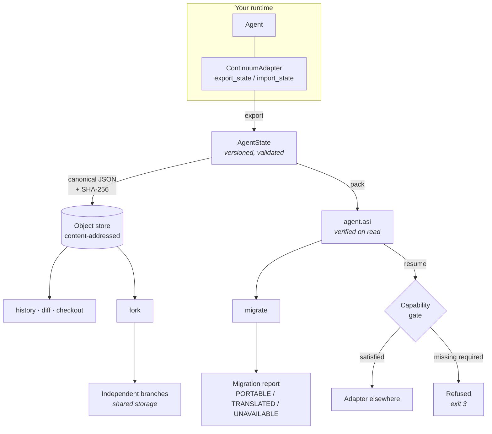

# Continuum

**Checkpoint a running agent, move it somewhere else, and continue.**

Continuum is an experimental state format and reference runtime for long-lived AI
agents. It gives an agent's execution state — objective, task position, memory,
artifacts, capabilities, event history — a portable, content-addressed
representation that can be snapshotted, forked, diffed, migrated between
providers, and resumed in a different process on a different machine.

```bash
pip install git+https://github.com/sandrexa1111/continuum-agent
continuum demo --workspace ./demo
```

The demo runs offline. No API key, no network, no model provider.

> Not on PyPI yet — the name is reserved-by-absence, not claimed. Install from
> source until a release is published there.

---

## Why this exists

Agent state today is scattered across whatever framework created it: a
conversation array here, a memory store there, tool configuration in a config
file, task position implied by a loop counter. That is fine while the agent
lives for thirty seconds inside one process.

It stops being fine the moment you want to do something ordinary:

- pause an agent overnight and continue in the morning
- move an in-flight agent from a laptop to a server
- run the same mid-task agent under two different models and compare results
- roll back to before the agent made a bad decision, and branch from there
- hand a reproducible failure to someone else
- know what an agent was actually holding when it went wrong

Each of these is a state portability problem. Continuum treats agent continuity
as an engineering primitive rather than a property of one framework.

**What it does not claim.** Continuum moves *execution state*, not model
internals. There is no transfer here of "what the model had learned" mid-
conversation. Attention caches, server-held conversation handles, and provider
prefix caches are not portable, and the tooling names them explicitly rather than
pretending otherwise.

---

## Architecture



Four ideas carry the design:

**Content addressing.** Every state is identified by the SHA-256 of its
canonical encoding. Identical states share one object, so forks cost a delta
rather than a copy, and lineage claims are verifiable rather than asserted.

**Canonical serialization.** Sorted keys, no insignificant whitespace, non-finite
floats rejected. Without a genuinely deterministic encoding, deduplication
breaks and diffs report changes that never happened.

**Portability is a property of a field, not a document.** The objective and
structured memory move. A provider's message representation gets translated. A
server-side thread handle does not move at all. The model separates these, and
`continuum migrate` reports which is which.

**Refuse rather than degrade silently.** A state declaring `filesystem.write`
that resumes somewhere without it does not start. An agent that runs for ten
minutes and then discovers it cannot finish is a worse outcome than a refusal at
second zero.

---

## What the demo shows

Seven scenes, each proving one claim — including the two negative ones, because
a demo that only shows the happy path is not evidence the checks exist.

```text
── 1. Run the agent partway, then stop ───────────────────────

  start        72e235bcdf2e
  suspended at 424f2c17b1ee  task='rank' step=2/5
  memory       10 entries (7 findings extracted)
  re-checkpoint without stepping -> same digest, nothing written

── 2. Export to a portable image and move it ─────────────────

  wrote        reviewer.asi (2106 bytes)
  verified     state.json and all blobs re-hashed on read
  round trip   byte-identical
  transported  to elsewhere/ (a different directory, empty store)

── 3. Resume there under a different model ───────────────────

  PARTIAL: 2 capability(s) satisfied, 1 optional missing
  continued from step 2 -> completed at step 5/5
  artifact     artifacts/report.md  852be5650aa8
  artifact     artifacts/review.json  0d0a232c4215

── 4. Fork the same checkpoint across two policies ───────────

  severity   39b4d3000290  top finding: **FIXME** — `auth-service.md:4`
  length     32891003eb1e  top finding: **risk** — `auth-service.md:5`
```

Scene 6 migrates to a smaller, tool-less destination and reports exactly what
survived:

```text
MIGRATION REPORT
  from   native-reviewer/mock/reviewer-severity
  to     other-runtime/another-provider/small-model

PORTABLE:
  OK   identity               carried unchanged
  OK   objective              goal preserved (2 constraints)
  OK   execution              task 'complete' at step 5
  OK   memory                 11 entries, structure preserved
  OK   artifacts              2 artifacts referenced by content address
  OK   events                 12 events, append-only history kept

TRANSLATED:
  ~    context                6 messages re-encoded for another-provider
  ~    context.budget         2 message(s) summarized to fit 95 tokens

UNAVAILABLE:
  DROP provider.opaque        2 provider-side handle(s) dropped:
                              cached_prefix_id, server_thread_id
                              (server-held state cannot be exported)

RESULT: COMPLETED WITH LOSS
```

Scene 7 refuses a resume that is missing `filesystem.write`, and finds a
credential that leaked into agent memory.

---

## Quick start

```bash
git clone https://github.com/sandrexa1111/continuum-agent
cd continuum-agent
pip install -e .
```

Run the reference story, then look at what it produced:

```bash
continuum demo --workspace ./demo
continuum history --store ./demo
```

```text
└── 72e235bcdf2e  initial          2026-08-11T14:10:58Z
    └── 424f2c17b1ee  after-extract    2026-08-11T14:10:58Z
        ├── 39b4d3000290  fork:severity    2026-08-11T14:10:58Z
        └── 32891003eb1e  fork:length      2026-08-11T14:10:58Z
```

Export, inspect, verify, resume:

```bash
continuum export 424f2c17 agent.asi --store ./demo
continuum inspect agent.asi
continuum verify --image agent.asi
continuum resume agent.asi --workspace ./elsewhere --grant 'filesystem.*' --run
```

Fork and compare:

```bash
continuum fork 424f2c17 --label severity --label length --store ./demo
continuum diff severity length --store ./demo
```

Check a destination before committing to it:

```bash
continuum migrate 424f2c17 --adapter other --provider p2 --model small \
    --max-context-tokens 4000 --grant 'filesystem.*' --dry-run
```

Scan a state for leaked credentials before sharing it:

```bash
continuum sanitize 424f2c17 --out clean.asi --store ./demo
```

Exit codes: `0` success, `1` failure, `2` usage, `3` a check came back negative
(resume blocked, integrity failure, secrets found). Every reporting command also
takes `--json`.

---

## Using it as a library

```python
from continuum import Store, checkpoint, fork, resume
from continuum.adapters.native import NativeReviewAgent

store = Store.init("./work")
agent = NativeReviewAgent("./work", agent_id="reviewer")

checkpoint(agent, store, label="start")
agent.step()
agent.step()
mid = checkpoint(agent, store, label="after-extract")

# Two branches from one checkpoint, sharing storage with their parent.
branches = fork(store.get_state(mid.digest), store, ["severity", "length"])

runner, report = resume(
    branches[0].state,
    NativeReviewAgent,
    granted=["filesystem.*"],
    workspace="./branch-a",
)
assert report.ok
final = runner.run_to_completion()
```

---

## Making your runtime checkpointable

Implement two methods. Continuum never touches your runtime beyond them.

```python
class MyAdapter:
    name = "my-framework"

    def export_state(self) -> AgentState:
        """Side-effect free and repeatable: calling it twice without running
        the agent must produce the same content address."""

    def import_state(self, state: AgentState) -> None:
        """Rebuild so execution can continue from `state`."""
```

Publish it from your own package — no change to Continuum required:

```toml
[project.entry-points."continuum.adapters"]
my-framework = "my_package.adapter:MyAdapter"
```

The protocol is checked structurally, so your class does not have to inherit
from or import anything of ours.

### Proof that this works

[`continuum-langgraph`](packages/continuum-langgraph/) is an adapter for
[LangGraph](https://github.com/langchain-ai/langgraph) — an independently
developed framework with its own checkpointing model that does not match
Continuum's.

```bash
pip install -e ./packages/continuum-langgraph
continuum adapters                      # langgraph now listed; core unchanged
python packages/continuum-langgraph/examples/interop_demo.py
```

The demonstration runs offline and shows a LangGraph agent stopped mid-graph,
exported, inspected by core tooling with `langgraph` never imported, and resumed
to completion in a fresh runtime with a new checkpointer — plus the two refusals
that matter: what the migration report drops, and a resume into a graph with
different topology.

It is installed as a **separate package**, so core keeps its zero-dependency
guarantee. CI asserts that: a job fails the build if `continuum-agent` ever
gains a runtime dependency.

Writing it also found two real defects — reducer channels duplicating on import,
and a stale execution frontier after a resumed step — both now regression-tested
and [written up](packages/continuum-langgraph/README.md#two-bugs-this-package-found).

---

## Project structure

```text
src/continuum/
├── model.py         the state model: versioned, validated, forward-compatible
├── canonical.py     deterministic encoding and content addressing
├── store.py         content-addressed object store, checkpoint graph
├── image.py         the .asi container, verified end-to-end on read
├── runtime.py       checkpoint / fork / resume
├── migrate.py       cross-provider translation with a portability report
├── compaction.py    fitting context into a smaller destination, accountably
├── capabilities.py  requirement vs grant checking, with namespace wildcards
├── diff.py          structured diff between two states
├── redact.py        secret detection and stable, non-reversible redaction
├── adapters/        the adapter protocol + a model-free reference runtime
└── cli.py           the command line

packages/
└── continuum-langgraph/   an independent adapter, installed separately

spec/                the format, normatively (+ agent-state.schema.json)
docs/adr/            why the load-bearing decisions went the way they did
tests/               264 tests, plus 32 in the adapter package
```

---

## Technical decisions

**JSON, not YAML, as the canonical form.** YAML has no canonical serialization,
and content addressing requires one.
([ADR 001](docs/adr/001-canonical-json.md))

**Zero runtime dependencies.** A format asking other projects to adopt it should
not drag a dependency tree behind it. Everything runs on the standard library.
([ADR 002](docs/adr/002-zero-dependencies.md))

**ZIP as the image container.** Every language and OS can already open one. A
reviewer can unzip a `.asi` and read the state with Continuum uninstalled, which
matters for a format that asks to be trusted.
([ADR 003](docs/adr/003-image-container.md))

**Unknown fields survive a round trip.** A 0.1 reader loading a document from a
future 0.1.x writer preserves the fields it does not understand and re-emits
them. Without this, every tool in an ecosystem silently destroys data written by
every newer tool. ([ADR 004](docs/adr/004-forward-compatibility.md))

**The reference runtime uses no model.** It reaches decisions by rule, so the
test suite is deterministic, the demo is reproducible, and the whole project is
evaluable offline. The parts under test — serialization, forking, lineage,
migration diagnostics — are identical either way.
([ADR 005](docs/adr/005-model-free-reference-runtime.md))

---

## Testing

```bash
pip install -e ".[dev]"
pytest                              # 244 tests
ruff check src tests
mypy src/continuum                  # strict
pytest --cov=continuum              # 95% statement coverage
```

The suite is built around the properties that have to hold rather than around
line coverage:

- **round trips** — serialization, images, and the store are fixed points
- **determinism** — the same logical state always produces the same address;
  the demo reproduces exactly under a pinned clock
- **integrity** — tampered objects, modified images, and truncated files are
  detected before any content reaches the caller
- **isolation** — running one fork does not change its siblings
- **refusal** — resume blocks on missing capabilities; compaction refuses rather
  than truncating an agent's instructions
- **container safety** — path traversal and decompression-bomb entries rejected

---

## Limitations

Stated plainly, because a state format that oversells itself is worse than none.

- **Experimental, pre-1.0.** The Python API will change. The on-disk format is
  versioned separately and is the part intended to stay readable.
- **No model internals.** Provider-side conversation handles, cached prefixes,
  and attention state do not move. Migration reports them as UNAVAILABLE.
- **Two shipped adapters.** The reference runtime, and
  [LangGraph](packages/continuum-langgraph/) — tested against LangGraph 1.2 and
  no other version. Other frameworks are unclaimed until someone runs them.
- **Cross-framework *resume* is not claimed.** A LangGraph frontier means
  nothing to another runtime. Cross-framework *inspection and analysis* is
  claimed and demonstrated.
- **Token counts are estimates** unless you supply a tokenizer. The built-in
  estimator is deliberately pessimistic.
- **The secret scanner finds accidents, not adversaries.** A credential with no
  recognizable shape, split across fields, or encoded will pass. Use it as a
  safety net, not a control.
- **Compaction summaries are structural**, not semantic, by default — they record
  what was dropped rather than paraphrasing it. Inject a summarizer for more.
- **No concurrent-writer locking.** One writer per store. Multi-process access
  is not yet coordinated.
- **`resume` restores what the adapter exports.** External side effects an agent
  performed before checkpointing are not undone by resuming an earlier state.

---

## Roadmap

Only work that is actually intended:

- more framework adapters, tested rather than claimed
- store-level garbage collection for unreachable objects
- optional image encryption (the manifest already supports selective export)
- multi-writer coordination

---

## Contributing

See [CONTRIBUTING.md](CONTRIBUTING.md). The design tests a change has to pass are
in [spec/compatibility.md](spec/compatibility.md): another framework must be able
to write an adapter without modifying Continuum core, and a reader must be able
to implement the format from `spec/` without reading this implementation.

Security issues: [SECURITY.md](SECURITY.md).

## License

Apache-2.0. See [LICENSE](LICENSE).
