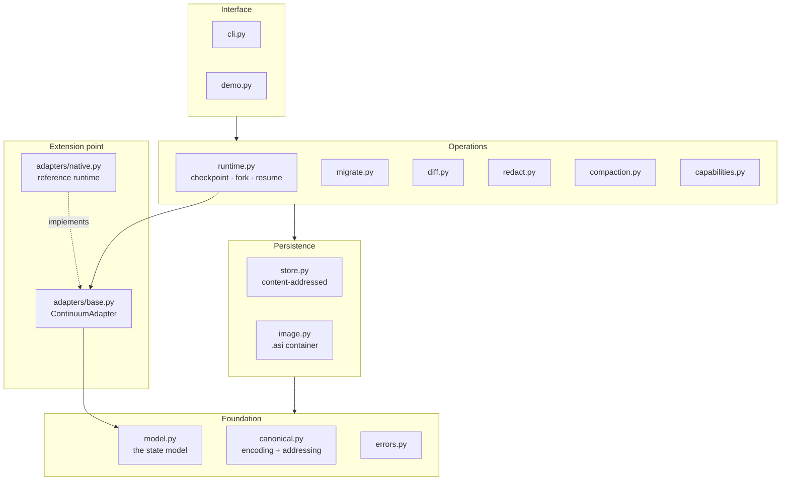

# Architecture

How Continuum is put together, what was hard, and where it breaks. The ADRs in
[adr/](adr/) cover individual decisions; this is the shape of the whole thing.

---

## The problem

An agent's state is currently an emergent property of whatever code is running
it. Conversation lives in an array, memory in a store, tool configuration in a
config file, task position in a loop counter. Nothing names "the agent's state"
as a thing you can hold.

That is fine for an agent that lives thirty seconds inside one process. It stops
being fine for pausing overnight, moving hosts, comparing two models on the same
mid-task agent, rolling back a bad decision, or handing someone a reproducible
failure.

Continuum's claim is narrow and testable: **agent execution state can be given a
portable representation, and the parts that cannot travel can be named
precisely.**

---

## Layers

Dependencies point downward only. `model.py` and `canonical.py` import nothing
from the rest of the package, which is what lets the spec be checked against
them and what keeps `model.py` free of I/O.

---

## The load-bearing decisions

### Content addressing is the spine

Every state is named by the SHA-256 of its canonical encoding. Almost everything
good downstream follows from that one choice:

- **Deduplication is automatic.** Storing identical bytes twice is a no-op.
- **Forks are cheap.** Eight branches from one checkpoint add eight small state
  objects, not eight copies of everything they inherited. Tested directly in
  `test_runtime.py::test_forking_shares_storage_with_the_parent`.
- **Lineage is verifiable.** `parent` is an address, so given the parent object
  you can *confirm* the claim rather than trust the index.
- **Tampering is detectable.** An object that no longer hashes to its own name
  is corrupt by definition.
- **Idempotent checkpointing falls out.** If the agent has not moved, the
  address is unchanged and nothing is written.

The cost is that determinism becomes mandatory, not nice to have. A single
unstable field anywhere in the model would break all five properties at once.

### `core_digest`: lineage is not part of identity

The subtle bug this exists to fix: if `checkpoint` sets `lineage.parent` to the
current head, then checkpointing an idle agent changes its lineage, which
changes its digest, which makes it look like new work — producing an infinite
chain of states that all represent the same moment.

So `AgentState` exposes two addresses. `digest()` covers everything.
`core_digest()` omits `lineage` and answers "is this the same agent state,
regardless of where it sits in the graph?" `checkpoint` compares `core_digest`
and returns the existing reference when nothing has happened.

### Portability is per-field, not per-document

The temptation is to declare the whole state portable and quietly drop what is
not. Continuum instead classifies each section as PORTABLE, TRANSLATED, or
UNAVAILABLE, and `migrate` returns a report saying which.

`provider.opaque` and `runtime_opaque` exist precisely so that non-portable
state has a declared home. The rule that nothing the agent *needs* may live
there is what makes migration honest rather than lossy-by-surprise.

### Refusal over silent degradation

Two gates, and neither pretends to be the other:

- **Continuum's gate** blocks a resume when a required capability is missing.
  `allow_degraded` lifts it.
- **The adapter's gate** is independent. An adapter with no reduced mode may
  still refuse, and the reference adapter does.

`allow_degraded` lifts Continuum's check; it cannot give a runtime a capability
it needs. Conflating the two would let an operator force an agent into an
environment where it fails at its first write — later, and more confusingly.

The same principle governs compaction: if pinned and system messages alone
exceed the budget, it raises rather than truncating the agent's instructions.
Quietly dropping a system prompt changes what the agent is trying to do.

---

## What was actually hard

**Making encoding deterministic in a way that survives contact with reality.**
Sorted keys are the easy part. The real work was deciding that absent and empty
must encode identically (otherwise two trivially-equal states get different
addresses), that non-finite floats must be rejected rather than coerced (they
become `null` in most parsers, silently), and that timestamps needed a
replaceable clock before "the demo is reproducible" could be a tested claim
rather than a hope.

**The cascading-redaction bug.** Redacting rule-by-rule meant each rule ran over
the *output* of the previous one. The placeholder `[REDACTED:github-token:440bb…]`
contains the literal text `token:440bb…`, which the generic assignment rule
matched happily — producing nested placeholders and a phantom third finding for
a field with two secrets. The fix was to collect spans from all rules over the
original text, resolve overlaps, and splice once. Caught by a test, and the
regression test now says why it exists.

**Entropy that could never fire.** The high-entropy heuristic was set at 4.2
bits/char. Hex tops out at log2(16) = 4.0, so the rule was structurally blind to
every hex-encoded key — it would never have fired on the thing it most needed to
catch. Lowering the threshold alone was not enough, because a long snake_case
identifier scores ~3.55 and hex ~3.79. The separating signal turned out to be
character-class mixing, not entropy.

**A Windows console crashing the CLI.** `history` renders a tree with
box-drawing characters, and a cp1252 console raises `UnicodeEncodeError`
printing them. Fixed by switching streams to UTF-8 where possible and falling
back to ASCII glyphs otherwise. Windows is now in the CI matrix specifically to
keep it fixed.

---

## Failure modes

| Failure | Detection | Behaviour |
|---|---|---|
| Corrupt store object | digest recomputed on read | `IntegrityError`; `verify` lists it |
| Tampered `.asi` | manifest and blob digests rechecked | refused before any content is returned |
| Truncated image | ZIP validity check | refused |
| Malicious archive paths | traversal + absolute path check | refused |
| Decompression bomb | uncompressed-size bound | refused |
| Future format version | version gate | refused with an upgrade hint |
| Missing capability | pre-resume check | resume blocked, exit 3 |
| Context too small | compaction floor check | reported as fatal in the migration report |
| Adapter cannot degrade | adapter's own gate | refused, with both gates explained |
| Concurrent writers | **not detected** | documented limitation; objects survive, index may lose an entry |

The last row is the honest one. Atomic renames mean objects never corrupt, but
`refs/*.json` is read-modify-write and has no lock.

---

## At 100× scale

What breaks first, in order:

1. **`refs/checkpoints.json` is rewritten whole on every checkpoint.** Fine at
   thousands; quadratic pain at millions. It would become an append-only log
   with a periodically-compacted index.
2. **`resolve()` scans every object** to expand a digest prefix. Needs a prefix
   index.
3. **No garbage collection.** Unreachable objects accumulate forever. A `gc`
   walking from checkpoint roots is the obvious fix and is on the roadmap.
4. **Whole-state rewrites.** Each checkpoint stores the full state, not a delta.
   Deduplication makes this cheaper than it sounds, but a large memory store
   would want per-section blob references — the model already supports this
   through artifact-style indirection.
5. **Single-writer.** Would need real locking, or a server.

None of these are load-bearing for the workloads this targets, and all are
storage-layer changes that leave the format untouched. That separation is
deliberate.

---

## What is deterministic, and what would depend on a model

**Fully deterministic** — everything in this repository: encoding, addressing,
storage, forking, lineage, diffing, capability checks, migration classification,
compaction, redaction, and the reference runtime.

**Would depend on a model, and is optional** — only the summarizer injected into
`compact_context`. The default is structural and model-free: it records what was
dropped rather than paraphrasing it.

That ratio is the point. Continuum is infrastructure for agents, not an agent.
Remove the words "AI" and "agent" from the description and it remains a
content-addressed store with a versioned schema, a verified container format, a
migration diagnostic, and a secret scanner — all of which are ordinary,
checkable systems engineering.

---

## Why not just write a script

The common objection: "this is `pickle.dump` with extra steps."

`pickle.dump(agent)` gives you a blob that only the exact same Python
process-shape can read, that cannot be inspected without executing it, that
silently breaks when the class changes, that has no notion of what the agent
needs from its environment, and that cannot tell you what was lost when you move
it somewhere else.

What Continuum adds over that, concretely: a versioned schema that survives
mixed-tool pipelines, an inspectable container anyone can open, verified
integrity, cheap forking through structural sharing, a diff that answers what
the agent did between two points, a capability gate that refuses impossible
resumes, and a migration report that names every piece of dropped state.

Whether that is worth a dependency is a real question. It should be asked
against the actual feature list, not against the pitch.
